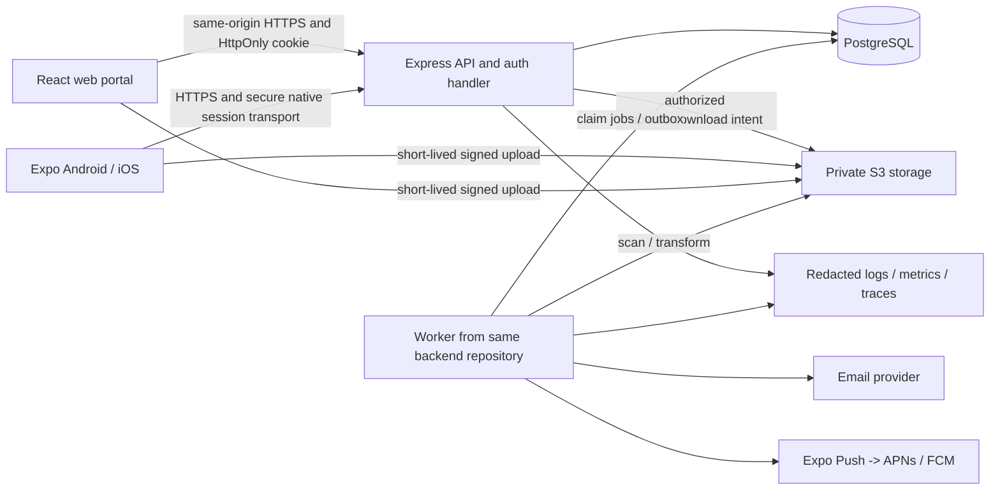
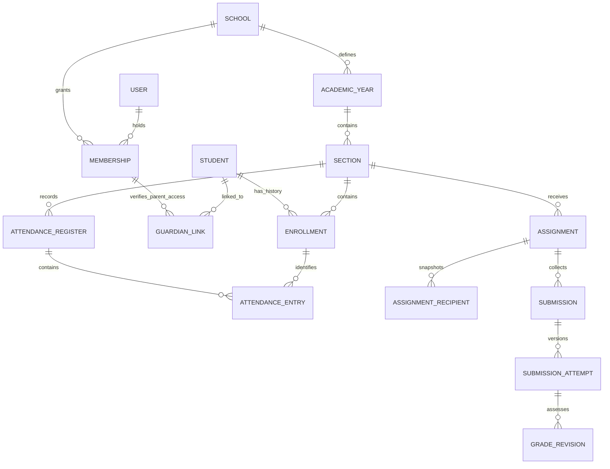
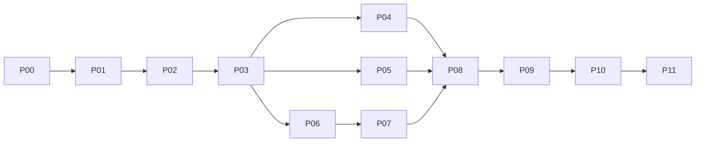

# School Management System — MVP implementation plan

**Prepared:** 5 October 2026. **Status:** proposed for review; implementation has not started.

This plan turns [ROADMAP.md](../ROADMAP.md) into an executable MVP programme. [todo.md](todo.md) is the ordered work queue; its task IDs are the implementation tracking system. Paths below are proposed repository-relative files, not files that already exist. Create them only when their task begins.

## 1. Objective and planning basis

Deliver a system in which a school administrator can establish accurate school records, a teacher can record attendance and assign/grade homework, and students and verified parents can see the relevant information, timetable and announcements on Android and iOS. Provide a responsive web portal for administration and all four roles as well. The product must operate safely with real pupil records before a pilot begins.

The repository currently contains the roadmap and engineering guidance, with no application, manifest, migrations or tests. This is a greenfield plan; there is no existing stack to preserve.

### 1.1 Resolving the roadmap's scope conflict

The roadmap calls Month 3 a beta MVP but also targets a production-ready MVP at Month 6. The proposed boundary is **the Month 3 feature set, built to a production-safe pilot standard**. Examination management, formal report cards, messaging, events/RSVP and fees remain follow-on releases. Production-safe means secure access, backups, support, monitoring and tested workflows; it does not imply the entire Month 6 feature set.

The proposed delivery has two release gates:

1. **Pilot MVP:** restricted school onboarding; web deployment, Android internal testing and iOS TestFlight; every in-scope workflow works.
2. **Public MVP:** the same feature set after pilot fixes, operational acceptance and store review. Public distribution does not silently expand scope.

Assumptions are provisional. Unresolved choices and their decision deadlines appear at the end of this file and `todo.md`, as requested. Planning proceeds without an interview or interim approval pauses. No source code, deployments, paid subscriptions or external communications are part of this planning change.

### 1.2 Engineering guidance incorporated

All **35 files** under `.agents` were read: 24 skill files, seven references, and the four additional idea-refine resources (including its shell script, which was read, not executed). The instructions contribute these implementation rules:

| Guidance | Application to this project |
|---|---|
| using-agent-skills, context-engineering | Load the active module's requirements and nearby implementation at each task; maintain a concise root `AGENTS.md` once development begins. |
| spec-driven-development, planning-and-task-breakdown | Capability map, explicit contracts, dependencies, acceptance criteria, file ownership and small tasks before implementation. |
| interview-me, idea-refine and all idea-refine resources | Distinguish assumptions from requirements; define non-goals; place questions at the end instead of interrupting this requested plan. |
| incremental-implementation, test-driven-development, testing-patterns | Build and verify thin end-to-end slices; reproduce defects with failing tests; prefer real database integration tests for integrity rules. |
| source-driven-development | Consult official version-specific documentation; pin dependencies; verify compatibility with a working slice. Examples in skills are illustrations, not an instruction to install their example versions. |
| api-and-interface-design | Typed contracts, consistent errors, pagination, optimistic concurrency and explicit retry semantics. |
| frontend-ui-engineering, browser-testing-with-devtools, accessibility-checklist | Design system, responsive layouts, real browser/device checks, all error/loading states, keyboard and screen-reader testing. |
| security-and-hardening, security-checklist | Threat model, least privilege, safe file pipeline, session security, supply-chain review and privacy lifecycle. |
| observability-and-instrumentation, observability-checklist | Structured logs, bounded metrics, trace correlation, actionable alerts and telemetry verification. |
| performance-optimization, performance-checklist | Measure realistic workloads before tuning; preserve before/after measurements and avoid speculative infrastructure. |
| code-review-and-quality, code-simplification, doubt-driven-development | Review correctness, structure, security and failure cases; explicitly record accepted trade-offs; simplify without weakening invariants. |
| debugging-and-error-recovery | Stop adding features when checks fail; reproduce, localize, fix the cause and retain regression evidence. |
| git-workflow-and-versioning, ci-cd-and-automation | Short-lived `codex/<task-id>-<description>` branches, small commits, protected main, frozen installs, reproducible builds and staging gates. |
| documentation-and-adrs, deprecation-and-migration | Preserve decision rationale; additive database changes; compatibility windows and tested recovery procedures. Never copy illustrative rollback commands without verifying tool support. |
| shipping-and-launch, definition-of-done | Acceptance criteria plus standing quality checks; staged release, support owner, monitoring, tested restore and rollback. |
| orchestration-patterns | One owner for shared contracts/migrations; parallel work only on independent slices; no unnecessary agent hierarchy. |

## 2. MVP scope and traceability

Requirement IDs connect product scope to tasks and eventual tests.

| ID | Capability and acceptance outcome | Delivery phase |
|---|---|---|
| R01 | Invited Admin, Teacher, Student and Parent users sign in, verify email by OTP, recover passwords, edit basic profiles and sign out. Uninvited users cannot acquire school access. | P02 |
| R02 | School staff configure academic year, holidays, classes/sections, subjects, students, enrolments, teachers and verified guardian links. Import is previewed before applying. | P03 |
| R03 | All four roles see relevant dashboards. Admin sees student counts and attendance; teacher sees assigned classes/tasks; student sees timetable/homework; parent sees linked children's summaries. | P04/P08 |
| R04 | Authorized teacher records one daily register per section, submits a complete register, corrects with an audit trail, and sees conflicts rather than overwriting another teacher. | P04 |
| R05 | Students/parents see attendance calendars and monthly reports; administrators can export accurate, scoped monthly CSV and PDF reports. | P04 |
| R06 | Admin publishes a conflict-free weekly timetable; clients show daily/weekly views, subject colours with labels, current period and countdown in school time. | P05 |
| R07 | Admin/authorized teachers publish urgent/general/event notices to permitted audiences, attach images/PDFs, expire/archive notices and notify recipients. Event-category notices are not an events module. | P06 |
| R08 | Teachers publish assignments with due dates, marks and files; students submit photos/files; teachers release grades/feedback; late status is explicit. | P07 |
| R09 | Durable in-app notifications plus native push for notices, assignments and released grades; permission denial or provider failure does not lose the underlying message. | P06–P08 |
| R10 | Previously fetched timetables and notice text are available read-only offline on mobile with stale-data labels, account isolation and expiry. | P08 |
| R11 | Web and native workflows survive slow networks, retries, expired sessions and denied permissions without silent data loss. | Every feature/P09 |
| R12 | Tested school isolation, secure attachments, accessibility, operational readiness, pilot onboarding and Android/iOS distribution. | Every phase/P09–P11 |

### 2.1 Explicit non-goals

Do not implement fee billing, payment gateways, fee collection dashboard values, exams/date sheets, ranked report cards, chat, typing indicators, event RSVP/calendar sync, library, inventory/shop, transport/GPS, admission applications, biometrics, AI, advertising, A/B testing, custom report builders or advanced analytics. Do not collect health information, identity documents, precise location or biometrics for this MVP.

Also defer SMS OTP, general offline editing/synchronization, automatic timetable generation, multi-campus management, school self-service signup/subscription billing, SSO and full multilingual translation. Structure text and dates to make later localization possible. Accessibility is included immediately, despite the roadmap placing some accessibility work in Month 9.

The admin dashboard's fee card is omitted rather than populated with fictitious values. Assignment marks are included; formal examination grading and report cards are not. App-store preparation begins early, while public submission follows the pilot gate.

### 2.2 Proposed pilot assumptions

- Two pilot schools initially, with capacity to onboard a third; approximately 500 active users across the pilot. Capacity fixtures cover 3 schools × 1,000 students, 40 sections per school and a full academic year's daily attendance.
- One campus per school, multiple sections per year group, one active academic year per school. A person may have memberships in multiple schools and multiple roles in one school.
- Daily section attendance, not attendance per subject period. A designated class teacher or explicit delegate marks the register.
- English first; a configurable IANA school timezone. `Asia/Karachi` is a sample seed value, not a hardcoded global setting or assumption about the target jurisdiction.
- Students may exist without login accounts. Student self-service in the pilot requires an approved individual email/account arrangement; never invent shared credentials or fake email addresses.
- Basic read-only mobile admin dashboard/notices/profile are included. Bulk administration, imports and timetable editing use the responsive web portal. Teachers can do attendance, homework and grading in both clients; students/parents can do their principal workflows in both clients.

## 3. Recommended stack and version policy

Use a **TypeScript monorepo**, a **React/Vite web application**, an **Expo React Native mobile application**, and an **Express modular monolith** with **PostgreSQL and Prisma**. A separate worker runs the same backend codebase's asynchronous jobs. This gives native camera/push/offline capabilities and a practical desktop administration UI without building multiple independent business backends.

This recommendation is an engineering judgment. The official sources below establish availability and documented integration, not that this entire combination has already been tested. **P01 is the compatibility proof and version-lock gate.**

| Area | Proposed baseline | Why / source checked 5 October 2026 |
|---|---|---|
| Runtime | Node.js 24 LTS, exact supported patch at bootstrap | Prefer an LTS runtime. [Node release schedule](https://nodejs.org/en/about/previous-releases). |
| Package manager | pnpm 11.x, exact `packageManager` pin | One workspace and authoritative lockfile; review build-script permissions. [pnpm 11](https://pnpm.io/blog/releases/11.0), [settings](https://pnpm.io/settings). |
| Language | TypeScript 6.0.x compatibility baseline, strict mode | Use a common compatible compiler first; evaluate newer stable compiler only after framework/type checks. This is not a claim that 6.0 is the newest. [TS 6 release notes](https://www.typescriptlang.org/docs/handbook/release-notes/typescript-6-0.html). |
| Web | React 19.2.x, Vite 8.1.x, React Router 7.x | Private portal needs no public SEO or server rendering. [Vite 8.1](https://vite.dev/blog/announcing-vite8-1), [React Router](https://reactrouter.com/home). |
| Mobile | Expo SDK 57, React Native 0.86.x, SDK-matched React 19.2 | Use at least Expo 57.0.17/RN 0.86.3 fixes, then resolve newer compatible patches. [Expo SDK 57 release and regression notes](https://expo.dev/changelog/sdk-57). |
| HTTP backend | Express 5.x; ESM | Small explicit middleware and route surface, direct auth integration; module discipline enforced by lint and review. [Express 5](https://expressjs.com/en/guide/migrating-5/). |
| Database | PostgreSQL 18.x on a managed provider | Relational integrity and transactions suit enrolments/registers/submissions. Keep local, CI and managed major versions aligned. [Support policy](https://www.postgresql.org/support/versioning/). |
| ORM/migrations | Prisma CLI and `@prisma/client` **7.10.0** initial candidate; matching v7 adapter | Deliberately stay on v7. Official documentation currently identifies Prisma 8 as a release candidate; unqualified CLI installs may select it. [Release status](https://www.prisma.io/docs/orm/release-status). |
| Authentication | Better Auth 1.7.7 initial candidate, matching `@better-auth/expo`, Prisma adapter | Library-managed passwords/sessions, email verification/reset and native integration. [Express integration](https://better-auth.com/docs/integrations/express), [Expo integration](https://better-auth.com/docs/integrations/expo). |
| Validation/contracts | Zod 4.x; OpenAPI 3.1 output | Single shared DTO schema source; verify the chosen OpenAPI generator against the pinned Zod release. [Zod](https://zod.dev/packages/zod). |
| Remote state | TanStack Query 5.x | Shared query-key conventions and bounded retries on web/native. [React Query documentation](https://tanstack.com/query/latest/docs/framework/react). |
| Web UI | Tailwind CSS 4.x, semantic HTML, selected accessible primitives | Keep reusable components local; do not add a full UI suite without checking its accessibility and size. [Tailwind v4](https://tailwindcss.com/blog/tailwindcss-v4). |
| Native UI/storage | React Native primitives, Expo Router, SecureStore, SQLite, image/document picker, notifications | Install native packages through the pinned Expo compatibility resolver, not independently selected latest versions. |
| Unit/integration tests | Vitest, React Testing Library, Supertest; Jest/jest-expo + RN Testing Library for native components | Resolve stable compatible versions in P01. Vitest 5 exists; 4.1 documents Vite 8 support, so choose the verified compatible stable line after a smoke run. [Vitest releases](https://vitest.dev/blog). |
| End-to-end | Playwright for web; Maestro for native installed builds | Real auth/API/database paths, separate accounts and isolated fixtures; real devices for push/camera. Exact versions locked in P01. |
| Storage | Private AWS S3 bucket; AWS SDK v3/presigned uploads | Final hosting region and account approved before real data. Local S3-compatible service for development; production compatibility checked in staging. |
| Messaging | Transactional email through Amazon SES; Expo Push Service to APNs/FCM | Email for account operations, in-app inbox as durable source, native push as best effort. [Expo push FAQ](https://docs.expo.dev/push-notifications/faq/). |
| Background work | PostgreSQL outbox/job table, one bounded polling worker | No Redis/Kafka dependency initially; transactional event recording and retry state stay with the data. |
| Telemetry | Pino structured logs, OpenTelemetry, Sentry error reporting | Version-pin SDKs at setup; no session replay or pupil-content collection by default. |
| Delivery | Docker, GitHub Actions, managed container host and managed Postgres; EAS Build/Submit | Proposed host: Render for API/worker/database if its region and service terms fit the school; otherwise change deployment ADR before provisioning. No provider accounts are created by this plan. |

Other libraries (CSV parsing, PDF generation, file signature checking, malware scanner client, rate limiter, OpenAPI emitter and test tools) must be recorded with exact versions, licenses, changelogs and compatibility results in `docs/dependencies.md` during P01. Their patch numbers have not been verified here; do not treat omissions as permission for floating dependencies.

### 3.1 Why this shape

- A PWA-only MVP would simplify delivery but changes the explicit native Android/iOS requirement and makes platform-specific notification behaviour a product trade-off. Retain native clients by default.
- Next.js is a reasonable alternative, but server rendering and an additional backend-for-frontend add little to this authenticated portal. A Vite SPA served on the API's origin is sufficient.
- NestJS offers stronger conventions but adds framework integration and decorator tooling. Small Express modules with tests are sufficient for the proposed team. Reassess only if maintainability evidence warrants it.
- Firebase can accelerate infrastructure, but this domain benefits from foreign keys, transactions and queryable historical records. A relational core avoids duplicating these rules in document structures.
- Supabase is a viable managed Postgres/auth alternative. The proposed design keeps database/auth under the backend boundary and avoids mixing direct-client writes with server-side policies.
- No microservices, Kubernetes, event-sourcing framework, generic repository base classes or universal web/native component layer. Share contracts and pure helpers; let each platform render appropriate UI.

### 3.2 Version-lock procedure

1. Record official release/support links and selected exact versions in `docs/dependencies.md`; examine registry metadata with `pnpm view <package> version engines peerDependencies --json` and version-specific metadata where needed. A registry `latest` tag is not proof of stability.
2. Pin Node patch, pnpm, direct dependency versions, container image digests and CI action SHAs. Commit one `pnpm-lock.yaml`; generated Expo requirements may use SDK-compatible ranges with exact resolutions in the lockfile.
3. First install with scripts disabled. Review necessary native build scripts and commit narrow `allowBuilds` decisions with fail-closed policy for the pinned pnpm client. Never approve all scripts.
4. Prove API startup, Prisma migration/query, auth session, browser request and an Android/iOS build before broad feature implementation. Better Auth's Expo guide names SDK 55: compatibility with SDK 57 is an explicit spike, not assumed.
5. Use only workspace-pinned CLI executables. Never run unqualified `npx prisma` or an unreviewed `@latest` scaffolder in CI.
6. Automated dependency PRs weekly; review related groups independently. Freeze major upgrades during pilot stabilization; still apply necessary security fixes.

## 4. Capability map and architecture

### 4.1 Module ownership

| Module ID | Owns | Depends on |
|---|---|---|
| identity | Auth integration, invites, profiles, account status | platform |
| school-access | Schools, memberships, roles and resource authorization | identity |
| academics | Years, school calendar, sections, subjects, teacher assignments, students, enrolments, guardian links | school-access |
| files | Upload intents, quarantine, attachment ownership and signed downloads | school-access |
| attendance | Daily registers, entries, corrections and monthly reports | academics |
| timetable | Versioned weekly schedules and conflict rules | academics |
| notices | Notice lifecycle, categories, audiences and attachment links | academics, files |
| assignments | Homework, audience snapshots, submissions and released grades | academics, files |
| notifications | Inbox, devices, delivery attempts and provider adapters | school-access; consumes platform outbox event contracts |
| dashboards | Scoped read-only aggregate views | attendance, timetable, notices, assignments |
| platform | Config, database client, HTTP errors, audit writer, jobs, logging, telemetry | no feature modules |

Feature modules write declared events to the platform outbox. They do not import notification delivery code. The worker consumes contracts and invokes owning modules' handlers; avoid a circular dependency between features and notifications. Audit and outbox inserts participate in the feature transaction.

### 4.2 Deployment and request flow



Serve the built web assets behind the same public origin as `/api/v1/*` and `/api/auth/*`; use a Vite development proxy locally. The API and worker are separate processes from one image/codebase. Scale them independently only after measurement. All business data access flows through the API; clients receive no database credentials.

**Request pipeline:** bounded body parser → request ID → request limits → session verification → active school membership → Zod validation → object/relationship policy → service transaction → DTO projection → structured result. Mount the auth handler according to its documented parser requirements. Public exceptions are a small allowlist: health, invite inspection with opaque token, and necessary auth endpoints.

**Layering:** `routes.ts` handles HTTP; `schemas.ts` in contracts defines inputs/outputs; `service.ts` implements use cases and transactions; `policy.ts` handles permissions; `repository.ts` contains tenant-scoped database queries when it materially clarifies the module. Avoid pass-through layers. Clients may hide actions for UX, but server policies are authoritative.

### 4.3 Tenant and relationship isolation

- Every school-owned row has non-null `schoolId`. Relationships use composite foreign keys `(schoolId, referencedId)` so a row cannot reference another school's student, section or file.
- Route `schoolId` selects a context; it never establishes permission. Derive `actorId` from the verified session and load current active memberships on every request. Ignore client-supplied roles and actor fields.
- `SchoolMembership` is unique by `(schoolId,userId)`; `MembershipRole` permits multiple role values. A parent who is also a teacher can use either authorized workflow.
- Parents require an active, staff-verified `GuardianLink`; students require an explicit account-to-student link. Matching surnames/email addresses never grants access. Link revocation takes effect on the next online request.
- Queries always include tenant plus relationship filters, including counts, exports, attachment access, search, job payloads and notification recipients. Cross-tenant object lookup returns 404 without leaking existence.
- Initial isolation relies on enforced application queries, composite database constraints and adversarial tests. PostgreSQL RLS is a possible later defence, not a claimed protection in this plan. No client or support-console direct access to business tables.
- The operational school-bootstrap command is separate from school-admin privileges. No general super-admin impersonation feature in the MVP. Bootstrap actions are audited.

## 5. Proposed repository and files

```text
tasks/plan.md, tasks/todo.md                 product plan and work queue
AGENTS.md, README.md, CONTRIBUTING.md       actual commands and contributor rules
package.json, pnpm-workspace.yaml
pnpm-lock.yaml, tsconfig.base.json
eslint.config.mjs, .prettierrc.json
.gitignore, .env.example, .node-version
apps/
  api/
    package.json, tsconfig.json, vitest.config.ts
    src/app.ts                            app factory for production and tests
    src/server.ts                         HTTP startup and graceful shutdown
    src/worker.ts                         job startup and shutdown
    src/config/env.ts
    src/auth/auth.ts                      Better Auth config and adapter
    src/auth/invitation-gate.ts
    src/middleware/{session,school-context,csrf,errors,rate-limit}.ts
    src/platform/{database,audit,jobs,idempotency,logger,telemetry}.ts
    src/modules/<module>/{routes,service,policy,repository}.ts
    src/modules/<module>/*.test.ts
    src/jobs/{scan-file,send-email,deliver-notification,export-report,cleanup}.ts
    tests/integration/<module>.test.ts
    tests/helpers/{database,fixtures,session}.ts
  web/
    package.json, tsconfig.json, vite.config.ts, index.html
    src/main.tsx, src/app/{router,providers,shell}.tsx
    src/lib/{auth-client,api-client,query-keys}.ts
    src/components/{Button,Field,Dialog,Table,Status,ErrorBoundary}.tsx
    src/styles/tokens.css
    src/features/<module>/{pages,components,hooks}/
    src/features/<module>/*.test.tsx
    public/                                icons only; no private uploads
  mobile/
    package.json, app.config.ts, eas.json, metro.config.cjs
    jest.config.cjs
    src/app/_layout.tsx
    src/app/(auth)/{sign-in,verify-email,forgot-password,reset-password}.tsx
    src/app/(school)/{index,attendance,timetable,notices,assignments,profile}.tsx
    src/features/<module>/{screens,components,hooks}/
    src/lib/{auth-client,api-client,notifications,offline-cache}.ts
    src/storage/{database,migrations,cache-policy}.ts
    src/components/{Button,Field,Screen,Status,ErrorBoundary}.tsx
packages/
  contracts/src/{common,identity,academics,attendance,timetable,notices,assignments,files,notifications,dashboards}.ts
  api-client/src/{client,errors,index}.ts
  database/
    prisma.config.ts
    prisma/schema.prisma                   domain + generated/reviewed auth schema
    prisma/migrations/<timestamp>_<name>/migration.sql
    prisma/seed.ts
    src/client.ts
  design-tokens/src/index.ts               colours, spacing, type scale
  test-fixtures/src/index.ts               synthetic factories, no real pupil data
docs/
  capability-map.md
  specs/<module>.md
  decisions/0001-mvp-scope.md               then stack, auth, tenancy, offline, files, jobs
  api/openapi.json                         generated; contract drift fails CI
  dependencies.md, data-model.md, permissions.md
  design/{flows,screen-inventory,content}.md
  privacy/{data-inventory,retention}.md
  runbooks/{deploy,rollback,restore,incidents,jobs,onboarding}.md
  user-guides/{admin,teacher,student,parent}.md
  verification/<task-id>.md
infra/
  compose.yaml                            local Postgres, object store, mail catcher, scanner
  Dockerfile, reverse-proxy.conf
  deploy.yaml                             chosen host's declarative service configuration
scripts/{bootstrap-school,seed-demo,export-openapi,check-boundaries,restore-check}.ts
tests/e2e/web/*.spec.ts, playwright.config.ts
tests/e2e/mobile/*.yaml
tests/load/{pilot,attendance-burst}.js
.github/workflows/{ci,staging,release,mobile-build}.yml
.github/dependabot.yml
```

Only introduce a shared package after a real consumer exists. `contracts` contains transport schemas and types, never database models, secrets, authorization decisions or Node-only imports. `api-client` uses an injected fetch/auth transport so browsers and native clients share requests without sharing session storage. Native UI does not import React DOM or Tailwind components.

Naming: kebab-case files except component names; PascalCase types/components; camelCase JSON; snake_case SQL mapping if selected consistently. Strict TypeScript, explicit exports, no unchecked `any`, no silent invalid-config fallbacks. Store dates as ISO strings at API boundaries and parse explicitly; money is not modeled in this release.

## 6. Data model and invariants

### 6.1 Entity catalogue

All entities use opaque IDs and UTC creation/update instants. School-owned entities carry `schoolId`. Mutable aggregates carry an integer `version`. Logical archive is a domain state; it is not a substitute for privacy deletion.

| Entity | Key fields / constraints |
|---|---|
| Auth User / Session / Account / Verification | Use the pinned Better Auth schema and migrations; do not hand-reimplement password/token internals. User activation/suspension must be enforced in the application guard. |
| School | name, unique slug, timezone, status; school timezone required before records are created. |
| SchoolMembership / MembershipRole | schoolId, userId, status; unique membership pair; unique `(membershipId,role)`; keep at least one active school admin. |
| Invitation | schoolId, normalized email, intended roles, token digest, expiry, inviter, acceptedAt, revokedAt; token single-use; no plaintext token in logs. |
| AcademicYear / SchoolDay | year label/start/end/status; day date/open-or-closed; one active year; holidays influence register denominator. |
| ClassLevel / Section / Subject | school-scoped names/codes; section belongs to academic year and class level; archive rather than delete referenced records. |
| TeacherAssignment | teacher membership, section, subject, start/end dates; homeroom/delegate marking permission explicit. |
| Student | school admission number unique per school, full name, status, optional user link unique by `(schoolId,userId)` when non-null; one identity may represent its pupil record in more than one school; collect date of birth/contact only if purpose approved. |
| Enrollment | student, section, academic year, start/end dates; prevent overlapping section enrolments within a year; history retained after transfer. |
| GuardianLink | guardian membership, student, relationship label, verifiedBy/verifiedAt, status; multiple children and guardians allowed. |
| ImportBatch / ImportRow | uploader, source digest, preview results, counts/status, committedAt; row errors do not contain unnecessary personal data. |
| AttendanceRegister | section, schoolDate, status DRAFT/SUBMITTED, submittedAt/by, version; unique `(schoolId,sectionId,schoolDate)`. |
| AttendanceEntry | register, enrollment, status PRESENT/ABSENT/LATE/EXCUSED, correction reason; unique `(registerId,enrollmentId)`; roster snapshot kept for history. |
| TimetableVersion / TimetableEntry | academic year, effective date interval, DRAFT/PUBLISHED/ARCHIVED; entry section, subject, teacher, weekday, local start/end, optional room. |
| Notice / NoticeAudience | author, title/body, category, publishedAt/expiresAt, version/state; OR across audience groups, AND between role and section within each group; school ownership enforced. |
| Assignment / AssignmentRecipient | section/subject/teacher, title/body, dueAt, totalMarks, state/version; recipient enrolments snapshotted at publish. |
| Submission / SubmissionAttempt | unique assignment/student aggregate; numbered attempts, submittedAt, lateAtSubmission, currentAttemptId; published grading references the assessed attempt. |
| GradeRevision | submission attempt, marks, feedback, grader, state DRAFT/RELEASED, releasedAt; marks constrained 0..assignment total; changes audited. |
| FileObject / AttachmentLink | uploader, immutable object key/version, declared/detected type, byte size, checksum, scan state, owning entity; download permitted only through owning resource policy. |
| Notification / DeviceRegistration | inbox recipient, event/entity reference, readAt; device token/install ID/environment/user, status, lastSeenAt; token reassociation is atomic. |
| OutboxEvent / Job / DeliveryAttempt | type, tenant, entity ID, event ID/version, availability, lease, attempts, provider receipt, terminal state; deduplication constraints. |
| IdempotencyRecord | actor/school/operation/key unique, canonical request hash, state/result/resource pointer, expiry. |
| AuditEvent | tenant, actor, action, entity, requestId, timestamp, minimal permitted change summary; append-only application access. |



### 6.2 Time and historical correctness

- Attendance uses a school-local SQL `date`; assignment due dates and audit timestamps use UTC instants. Timetables use local weekday/time plus school timezone and effective dates.
- Reject nonexistent local times and require disambiguation for repeated DST times when converting deadlines. Test a DST timezone even if the first school uses Pakistan time.
- Enrollment intervals are `[startDate,endDate)`; null end means continuing. Transfers close the old interval and open the new interval in one transaction. Use a database exclusion constraint or locked overlap check backed by a serialized transaction; document the selected mechanism.
- Current rosters are not used to rewrite historical registers, assignment recipients or reports. Withdrawn students retain historical records but lose current class access.
- Backdated enrolment corrections explicitly reconcile affected registers: refresh draft roster eligibility and increment the register version; require an admin correction for submitted registers, preserving superseded entries and reasoned history. Reports use the corrected eligibility revision consistently. Never silently remove a recorded mark because today's roster changed.
- Archived academic years are read-only except a separately authorized, reasoned correction workflow. MVP year rollover is manual setup plus reviewed promotion/import, not an automatic promotion engine.

### 6.3 Indexes and migration discipline

Create tenant-leading indexes on membership lookup, student admission number, enrolment section/date, register section/date, student attendance history, published notice feeds, assignment due date, submission assignment/status, notification user/createdAt and runnable job status/availableAt. Measure execution plans with seeded data; add indexes for actual slow paths.

Migrate module by module. Commit SQL migrations, including constraints not expressible in Prisma. Run migrations against both an empty database and the last released schema with fixtures. Production uses `prisma migrate deploy` from the pinned v7 executable; no `db push`. Use expand/backfill/contract for later changes. A rollback normally means redeploying the previous application against backward-compatible schema; destructive database reversal is not automatic. Test restore/forward repair where SQL down migration would lose data. No fictitious `prisma migrate rollback` command.

## 7. Authorization and authentication contract

| Action | Admin | Teacher | Student | Parent |
|---|---|---|---|---|
| School setup, users, classes, imports | Own school | No | No | No |
| Student roster | Own school | Assigned sections; minimal fields | Self only | Linked children only |
| Attendance write | Own school with reason for corrections | Designated sections/dates | No | No |
| Attendance read/report | Own school | Assigned sections | Self | Linked children |
| Timetable edit/publish | Own school | No | No | No |
| Timetable read | Own school | Assigned schedules | Enrolled section | Linked child sections |
| Notice publish | School/selected audiences | Assigned sections only | No | No |
| Assignment create/grade | Oversight/correction with audit | Assigned subject/section | No | No |
| Submit assignment | No impersonation | No impersonation | Own published assignment | Read-only by default |
| Read released grades/files | Own school under policy | Assigned assessments | Own | Linked child |
| Notification inbox/devices | Own personal inbox | Own | Own | Own |

Use Better Auth's documented Express handler and Prisma adapter. Mount `/api/auth/*`; application endpoints use `/api/v1/*`. Public account creation is gated by a valid school invitation. Invitation acceptance verifies email, creates/links the identity and applies only the server-stored intended roles. Existing users can accept another school invitation without replacing earlier memberships. Compensate/retry safely if identity creation and membership acceptance cannot share one transaction.

Browser sessions use Secure, HttpOnly, SameSite cookies on a single origin; no localStorage tokens. Native session transport uses the Better Auth Expo plugin and SecureStore. Disable server session-cookie caching for immediate revocation checks; native cached display state never authorizes a request. [Session management](https://better-auth.com/docs/concepts/session-management), [native transport](https://better-auth.com/docs/integrations/expo).

Proposed session lifetime is seven days, with recent authentication (five minutes) for role changes, security settings and sensitive exports. School suspension and membership revocation are checked on every request. Logout/recovery invalidates relevant sessions and device registrations and clears local school data. Password reset revokes other sessions. Require administrator TOTP MFA before real-data launch; use the library's supported plugin and recovery-code flow, not custom cryptography. [Available auth plugins](https://better-auth.com/docs/plugins).

Email verification uses OTP (proposed 10-minute lifetime, five attempts, resend cooldown); password reset uses a single-use expiring link. Verify actual plugin settings in P02. Generic public responses prevent account enumeration. Apply per-IP and per-account throttles without a permanent attacker-triggerable lockout. Never log passwords, OTPs, tokens, reset URLs or full email bodies.

CSRF protection applies to all application mutations on both clients: a session-bound token obtained from authenticated `GET /api/v1/csrf` is required in a custom header. Present browser Origin must match the allowlist; reject null/foreign origins. An absent Origin is accepted only with a valid session AND CSRF token, supporting native requests without an origin-only exemption. A caller-controlled native header never bypasses protection. Deny cross-origin reads of the token endpoint; cookies alone are insufficient for any mutation. Retain the auth library's separate origin/CSRF protection and test its native integration explicitly. Production trusted origins/deep-link schemes are allowlisted; development wildcards stay in development.

Student identity binding is an explicit staff operation: an invitation may reference a preselected school student record; after verified matching-email acceptance, bind the resulting user to that record under a unique constraint. Existing-account association/reassociation requires recent administrator authentication, verified identity, school membership and an audit reason. Reassociation revokes the old account's pupil access and purges its context on the next online request; never let a student choose another pupil's record. Records without an account remain usable for staff attendance/parent viewing.

## 8. Feature specifications and edge cases

### 8.1 Onboarding and school records

An operator bootstraps school plus first-admin invitation. Admin configures year/calendar, sections, subjects and teaching assignments before students are enrolled. Allow manual entry and CSV import with a downloadable documented template, preview, row errors, duplicate detection and explicit commit. Initial import cap: 1,000 rows per batch. No password import.

Preview includes normalized admission numbers and section matches; unresolved references block commit. Revalidate at commit under transaction/locks because the database may have changed since preview. Same batch cannot commit twice. Offer downloadable sanitized errors; escape spreadsheet formula prefixes in CSV exports. Parent links are reviewed separately rather than inferred from imported contact fields. Keep an audit entry for import actor/counts/result.

### 8.2 Attendance

1. Select section and school date; API checks assigned marker, open school day and enrolment interval.
2. Load a register with snapshot roster and version. Initial entries are **unmarked**, never implicitly absent or present.
3. Teacher marks individuals or explicitly uses “mark all present”; UI displays counts and unsaved changes.
4. Save draft; submit only when every eligible entry has a status. Transaction commits entries, status, audit and outbox event together.
5. A stale version yields 409 and a comparison/reload screen. Never silently merge two full-register writes.
6. Teacher may correct today's submitted register with a reason; older corrections require admin. Future dates/closed days are rejected unless admin uses an explicit audited exception.

Percentage proposal: `(present + late) / (present + late + absent) × 100`; excused and unmarked do not enter this denominator. Reports also show excused, unmarked and submitted-register coverage separately, so incomplete marking cannot look like perfect attendance. With zero eligible recorded days show “Not available,” not 0% or 100%. Monthly reports use historical enrolments and holidays. This policy is a review question, not a universal school rule.

Parent online view refreshes on focus and while foregrounded (target within 30 seconds of a teacher's successful save). This is the proposed interpretation of roadmap “real-time”; strict live streaming is a separate scope decision.

### 8.3 Timetable

Admin creates a draft timetable version with effective dates. Validate positive durations, school day bounds and overlaps for sections, teachers and rooms (when room is supplied), including concurrent publish attempts. Publish atomically, retaining historical versions. Multiple sections cannot book the same teacher at overlapping times. Use a consistent school/year publish lock plus conflict query, not only front-end checks.

Clients select the version effective on the viewed date. Breaks and free periods are explicit; holidays have no active class. Current-class countdown derives from server time offset and school timezone; refresh on foreground and clock changes. No automatic scheduling, substitutions or rotating-week patterns in the baseline.

### 8.4 Notices

State flow: DRAFT → PUBLISHED → ARCHIVED, with `expiresAt` controlling feed visibility. Plain text/limited safe formatting only. Title/body length caps and attachment caps enforced server-side. Audience groups combine with OR; within a group, role AND section must both match if supplied. A role-only group is school-wide for that role; an empty group is invalid. Parent section membership derives from an active verified child link and enrolment; teacher membership derives from dated assignment. Multi-role users match any authorized group once. Reuse this exact predicate for preview counts, reads, attachments and delivery. Preview audience count before publishing; teachers cannot widen beyond assigned sections. Publication inserts one durable event. Updates have a revision and do not resend push unless explicitly republished according to policy.

Online reads always re-evaluate current audience access; archived/expired notices disappear from normal feeds. Inbox entries point to the resource and do not bypass its access rules. An inaccessible deep link explains that the item is unavailable without showing restricted content.

### 8.5 Assignments, submissions and grading

Assignment state: DRAFT → PUBLISHED → CLOSED → ARCHIVED. “Pending/Submitted/Graded” is the student's derived status, not a second incompatible assignment lifecycle. Publish snapshots the eligible students; later enrolments require an explicit teacher/admin add-recipient action. Close forbids new attempts; archive preserves records.

Teachers define dueAt and positive totalMarks. Students may submit text and/or up to five allowed attachments. Server `submittedAt` determines lateness (`submittedAt > dueAt`), not the device clock. Draft/upload time does not reserve an on-time submission. Accept late work with a visible label by default. Allow replacement before grading/closure, keep prior attempts, and prevent retry duplicates. Reopening after grading is an explicit teacher action; the grade remains attached to the original attempt until a new grade is released.

Grades are numeric to two decimal places and must lie in `[0,totalMarks]`; use decimal database arithmetic. Teacher drafts feedback and explicitly releases it. Students/parents never see draft marks. Corrected released grades create a revision/audit trail. Changing totalMarks after submissions requires an explicit rule; baseline forbids it. Parents view but do not submit on the child's behalf until that policy is resolved.

### 8.6 Attachments

Proposed limits: JPEG/PNG/WebP/PDF, 10 MiB per file, five per entity/attempt, bounded school storage quota configurable before launch. Reject executable, HTML, SVG and archive files. Phone HEIC images must be converted to an allowed image format before upload or receive an actionable error.

Workflow: authorized upload intent → unique private quarantine object key → short-lived signed upload → completion request verifies actual object metadata/checksum → scanner job validates magic bytes and malware scan → optional image re-encoding/metadata stripping → immutable clean object → READY attachment. Recheck ownership when linking a READY file to a notice/assignment/submission. Scan failure/outage leaves file unavailable with retry state; never fail open.

Capture a quarantine S3 version ID and scan/promote that exact version, persisting its checksum. If the local object service lacks versioning, copy first to a server-only immutable candidate and scan that candidate. Never scan one version and later copy whatever bytes happen to occupy the key. Promotion is idempotent by file/version; a still-valid upload URL cannot replace READY bytes. Download URLs last at most 60 seconds and are issued only after current resource authorization; these URLs remain usable until expiration, which is a documented revocation limit. Serve downloads with safe content disposition and `nosniff`; never expose bucket listing or public objects. Unlinked quarantine objects expire after 24 hours. Cleanup uses a locked reference check and deletion state to avoid deleting a file in a committed submission.

### 8.7 Notifications and background jobs

Create business change, audit and outbox event in the same database transaction. Worker claims bounded batches with `FOR UPDATE SKIP LOCKED`, lease expiry and heartbeat; crashes return work to retry after the lease. Each claim increments a fencing generation; heartbeat/completion/retry and business-state writes condition on the current generation, so a resumed stale worker cannot overwrite a newer attempt. External sends cannot be undone by fencing; provider idempotency/unknown-outcome handling still applies. Deduplicate inbox by event/recipient and deliveries by event/recipient/channel/device. Recheck current membership/audience and active device session immediately before sending.

Retry transient failures with exponential backoff and jitter (five attempts over up to 24 hours); permanent errors become visible terminal failures. Provide an operator retry command with audit and original event identity. Keep deduplication records for at least 30 days; do not replay older jobs without an explicit reconciliation operation. Worker must handle “provider accepted, response lost” as an unknown outcome: use provider idempotency when offered, otherwise tolerate bounded duplicate generic push while never duplicating inbox records or business writes.

Register/unregister devices after login, logout, token rotation and environment changes. Process push receipts and disable invalid tokens. A provider receipt means accepted/processed, not proof the pupil saw a notification. Use generic lock-screen text; fetch details after authentication. In-app inbox works without push permission. [Expo delivery semantics](https://docs.expo.dev/push-notifications/faq/).

### 8.8 Offline and client state

Mobile caches only previously authorized timetable data and notice text in app-private SQLite, partitioned by user/school/child. No grades, attendance details, rosters or binary attachments persisted offline in the baseline. A user may opt into remembered school content; shared-device mode disables it. Record schema version, resource revision and last successful sync.

Cache expires after 24 hours; notices also expire at `expiresAt`. Clear on logout, account/school/child switch, session rejection and detected revocation. On reconnect, reauthorize before refreshing; process deleted/archived items. Offline access revocation cannot be immediate on a disconnected device; the maximum stale-access window is the cache TTL and requires school acceptance before enabling caching. OS sandbox storage is not a claim of independent database encryption.

Mutations are online-only. Disable save offline with an honest explanation and retain only safe in-memory edits during a temporary connection loss. Never show “saved” before server acknowledgement. Query keys include identity/school/child/filters; clear memory caches before rendering the next context. Auth boot screens must not flash the previous user's data.

## 9. API contract inventory

Base `/api/v1`; authenticated school resources under `/schools/:schoolId`. `/api/auth/*` is the library's documented auth contract, tested separately. Below are proposed endpoint families; expand exact schemas in `packages/contracts` and generated OpenAPI before implementing each slice.

| Family | Methods / paths | Core guards and semantics |
|---|---|---|
| Identity | `GET /me`, `PATCH /me`, `GET /me/memberships` | Explicit editable profile allowlist; no role edits through profile. |
| CSRF | `GET /csrf` | Authenticated, no-store, same-origin token read; required on business mutations from browser and native clients. |
| Invitations | `POST /schools/:schoolId/invitations`, `POST /invitations/:token/accept`, `DELETE /schools/:schoolId/invitations/:id` | Admin invite; opaque token acceptance, verified matching email, single-use. Tokens redacted from route logs. |
| Memberships | `GET/PATCH /schools/:schoolId/memberships/:id` and list | Admin; optimistic version; cannot remove last active admin. |
| Academic setup | List/create/update/archive `/academic-years`, `/school-days`, `/class-levels`, `/sections`, `/subjects`, `/teacher-assignments` | School prefix; admin writes, constrained scoped reads. |
| Students | `GET/POST /students`, `GET/PATCH /students/:id`, `POST /students/:id/enrollments` | School prefix; paginated roster; atomic transfer, historical integrity. |
| Student accounts | `PUT /students/:id/account`, `DELETE /students/:id/account` | School prefix; recent admin authentication, verified identity binding, uniqueness and audited reassociation/revocation. |
| Guardian links | `POST/PATCH /guardian-links`, `GET /me/children` | Staff verification for writes; actor-scoped child list. |
| Imports | `POST /imports`, `GET /imports/:id`, `POST /imports/:id/commit` | School prefix; validated preview then idempotent commit. |
| Attendance | `GET/PUT /sections/:id/attendance/:date`, `POST /sections/:id/attendance/:date/submissions` | School prefix; atomic bounded register writes, If-Match, stable idempotency key. |
| Attendance reports | `GET /students/:id/attendance`, `POST /attendance-reports`, `GET /attendance-reports/:id` | School prefix; date bounds and scope; exports are async private files. |
| Timetable | `GET/POST /timetables`, `PATCH /timetables/:id`, `POST /timetables/:id/publications` | School prefix; effective versions and atomic conflict check. |
| Notices | `GET/POST /notices`, `GET/PATCH /notices/:id`, `POST /notices/:id/publications` | School prefix; audience policies, archive via explicit state transition. |
| Assignments | `GET/POST /assignments`, `GET/PATCH /assignments/:id`, `POST /assignments/:id/publications`, `POST /assignments/:id/recipients` | School prefix; teacher/section/subject policy, lifecycle guards. |
| Submissions | `GET /assignments/:id/submissions`, `POST /assignments/:id/submissions`, `GET /submissions/:id`, `POST /submissions/:id/reopenings` | School prefix; student own create, teacher review, grade-bound versions. |
| Grades | `PUT /submissions/:id/grade`, `POST /submissions/:id/grade/publications` | School prefix; assigned teacher/admin, marks range, attempt identity and version. |
| Files | `POST /files/upload-intents`, `POST /files/:id/completions`, `GET /files/:id`, `POST /files/:id/downloads` | School prefix; owner/type/size/scan/access checks; presigned capabilities only. |
| Notifications | `GET /me/notifications`, `PATCH /me/notifications/:id`, `POST/DELETE /me/devices` | User-owned records; optional validated school filter, no cross-account read. |
| Dashboards | `GET /dashboard?role=...&childId=...` | School prefix; role must belong to actor; child verified, no fees. |
| Operations | `GET /health/live`, `GET /health/ready`; internal worker health | Minimal public output; readiness checks database, liveness does not expose config. |

Responses use `{ data, meta? }`; errors use `{ error: { code, message, fieldErrors?, requestId } }`. Map malformed requests to 400, no session 401, forbidden action 403, hidden/missing object 404, version/in-flight conflicts 409, oversized body 413, validation 422, throttling 429 and generic internal failure 500. Auth library responses retain their own contract; clients normalize them explicitly rather than pretending they use the business envelope.

Lists use `cursor`, `limit` (default 25, maximum 100) and stable `(createdAt,id)` ordering where appropriate. Report ranges are capped at one academic year; bulk registers capped at configured section capacity (initial 100 students). Whitelist sort/filter fields.

Mutations that create records or publish/submit use `Idempotency-Key`: client generates once per intent and retains it across retries. Atomically claim `(schoolId,actorId,operation,key)`; reject same-key/different-body with 422; return 409 while processing; replay completed response after rechecking access. The transaction stores business changes and successful result together; never leave a committed mutation without its dedup result. Keep records 30 days and limit client retry to 24 hours. Updates additionally require `If-Match` version. Downloads and routine reads do not need idempotency records.

## 10. UX, accessibility and screen inventory

Use a calm, dense-enough administration UI with clear tables and a simpler mobile layout. Choose school-neutral semantic tokens; school branding is initially name/logo only. Do not build a marketing site in this workstream.

| Journey | Web screens | Mobile screens |
|---|---|---|
| Shared identity | Sign in, invitation acceptance, OTP, reset, profile, school/role switcher | Same; verified app links, secure session restoration |
| Administration | Onboarding checklist, people/roles, students/import, enrolment, guardian review, academic setup, timetable editor, reports, audit list | Overview, notices, profile; links explain web-only admin actions |
| Teacher | Assigned classes, register editor/history, assignment composer, submissions, grade review | Same principal teaching workflows with mobile forms/camera |
| Student | Dashboard, attendance calendar, timetable, notices, assignment list/detail/submission, grades | Same core screens and upload progress |
| Parent | Child selector, child dashboard, attendance, timetable, notices, assignments/released feedback | Same, with child identity always visible |
| Shared communications | Inbox, notice detail, file state/download, notification preferences | Inbox, push permission education, deep-link handling |

Wireframe at least: admin setup, teacher register, weekly timetable, notice composer/detail, assignment submission/grading, and parent child dashboard. Each must define loading, empty, validation, unauthorized, offline, stale, conflict and server-failure states where relevant.

Target WCAG 2.2 AA on web: semantic controls, visible focus, proper labels, contrast, no colour-only status, keyboard-complete flows, accessible tables, error summaries and 200% zoom. Test 320/768/1024/1440 px widths and real long names. On native, test TalkBack and VoiceOver, dynamic text, touch targets, safe areas, keyboard avoidance and reduced motion. Proposed minimum OS follows SDK 57 support plus actual pilot device survey; do not assume all existing school phones qualify.

## 11. Testing, security and operational targets

### 11.1 Verification layers

- **Unit:** attendance denominator, interval overlap, timetable conflicts, late submission, grade limits, audience evaluation and retry/backoff using fixed clocks.
- **Integration:** real PostgreSQL constraints/transactions, actual auth middleware, cross-school IDs, parent links, teacher scope, file ownership, idempotency/concurrency, imports and worker recovery. Never mock away the policy being tested.
- **Component:** user-visible form/error/permission states with Testing Library on web and native.
- **Contract:** parse responses against shared schemas, generate OpenAPI, detect drift; test old released client fixtures against new API responses.
- **E2E:** admin invite/setup → teacher attendance → parent view; assignment publish → student upload/submit → teacher grade release → parent view; notice publish → inbox/deep link; auth reset/revocation; offline/context switch.
- **Device:** real Android and iPhone push/camera/file picker/background/deep links; emulator tests do not prove provider delivery.
- **Security:** two-school negative matrix on every resource family; forged role, revoked relation, CSRF, XSS, malicious upload, presigned overwrite, throttling and dependency audit.
- **Recovery/load:** worker killed after claim/send; database disconnect; previous-schema migration; database plus object restore; realistic concurrent attendance burst and slow mobile network.

Proposed coverage floor: 80% statements and branches for owned domain/policy code, with explicit tests for every allow/deny rule. Generated code and vendor internals are excluded. Coverage alone is not acceptance. Every bug fix includes a regression test. Documentation-only changes require document/link/consistency checks, not invented runtime test claims.

### 11.2 Measurable pilot targets

| Area | Initial target and measurement |
|---|---|
| Attendance usability | Teacher marks/submits a 40-student class in under two minutes in pilot observation; no silent overwrite or default absence. |
| Adoption | ≥80% of scheduled section-days have a submitted register by the school's agreed cutoff, measured over ten school days. Denominator excludes closure days. |
| Engagement | Track 500 active users as a rollout goal, defined as unique authenticated users completing a core action/view within seven days; not a software correctness gate. |
| Reliability | ≥99.5% successful eligible API requests over pilot observation; no unresolved P0/P1 defect or data-isolation incident. |
| Client stability | ≥99.5% crash-free native sessions as a proposed improvement over the roadmap's <5% crash rate. Measure with privacy-filtered telemetry. |
| Latency | p95 reads ≤500 ms and register writes ≤1 second on representative staging, excluding upload transfer; dashboard refresh ≤2 seconds end-to-end on agreed network. |
| Web | p75 LCP ≤2.5 s, INP ≤200 ms, CLS ≤0.1 on representative mobile hardware/network; synthetic checks first, field data during pilot. |
| Assets | Initial web JS target ≤250 KiB gzip; route-split export/report dependencies; record deliberate exceptions. |
| Load | 100 active sessions plus 30 simultaneous register saves; ramp to 250 sessions to locate saturation. Full 1,000-concurrent-user target belongs to a later scale gate unless pilot demand requires it. |
| Jobs | p95 inbox creation ≤30 s from publication; alert if oldest runnable notification job >5 minutes. Distinguish provider acceptance from device display. |
| Recovery | Proposed RPO ≤24 hours and RTO ≤4 hours for pilot, tested for database and files; tighten and fund PITR if schools require it. |

### 11.3 Security and privacy work

Threat model untrusted clients, school administrators, compromised teachers, shared devices, external email/push providers and uploaded documents. Key abuse cases: guessing another child's ID, widening notice audience, grading a different class, importing another school's section, linking a stolen upload ID and replaying a revoked invitation.

Apply TLS, bounded payloads, parameterized queries, CSP for web, strict CORS/origin configuration, rate limits and least-privilege credentials. Keep migration credentials separate from runtime credentials. Private pupil files never enter public assets, preview environments, test fixtures or source control.

Document field purpose, access, retention, deletion and third-party disclosure before real-data onboarding. Proposed engineering defaults: auth challenges expire rapidly; orphan uploads 24 hours; offline data 24 hours; operational logs 30 days; idempotency/delivery dedup 30 days. Educational records, audits, backups and account retention require the school's approved policy. These are planning defaults, not legal compliance claims. Region/jurisdiction, lawful basis, guardian consent/authority and vendor agreements must be reviewed by the responsible school/operator.

Provide an administrator-assisted export/correction/deletion process with identity verification, approval record and legal-hold handling. Deletion inventories auth, domain rows, files, devices, telemetry and derived caches. Backup retention determines when deleted data ages out; restored backups replay the deletion ledger before reopening access. Do not promise instantaneous erasure from immutable backups.

### 11.4 Observability

Answer: Can people sign in? Are registers saved? Are file scans/notifications stuck? Which dependency is causing errors? Instrument endpoint rate/errors/latency, connection pool saturation, job age/attempts, scan failures and native crashes. Use low-cardinality route templates, never user/school IDs as metric labels.

Logs contain request ID, stable event name, route template/status/duration and sanitized references; no pupil names, bodies, tokens, signed URLs or passwords. Audit records are access-controlled business evidence, separate from operational logs. Propagate trace context into jobs and provider calls. Test alerts and diagnose an injected staging fault from telemetry alone. Assign an on-call/support owner before release.

## 12. Delivery phases, dependencies and effort

Effort is a **planning range in engineer-days**, including implementation and focused verification, not a delivery promise. Assumes two full-time engineers spanning backend/web/mobile, with part-time QA/design and a responsive school contact. Review and store queues add elapsed time. Re-estimate after P01 and the first attendance slice. For one engineer, expect a substantially longer schedule.

| Phase | Tasks | Outcome / gate | Effort |
|---|---|---|---|
| P00 — product contracts | T001–T006 | Scope, decisions, UX and threat/data map reviewable | 4–6 days |
| P01 — walking skeleton | T007–T018a | Reproducible workspace, native/web/API/DB builds and CI; compatibility proven; synthetic HTTPS staging available | 9–14 |
| P02 — identity and access | T019–T030 | Invites, sessions, four roles and tenant isolation; auth failure cases pass | 9–13 |
| P03 — school data | T031–T042 | A school can prepare trustworthy rosters and permissions | 9–13 |
| P04 — attendance slice | T043–T051 | Teacher marks, parent reads, reports reconcile | 8–12 |
| P05 — timetable | T052–T057 | Conflict-safe publishing and correct client schedule | 4–6 |
| P06 — files and notices | T058–T069 | Secure upload pipeline, notices and durable inbox | 9–14 |
| P07 — homework | T070–T081 | Publish → submit → grade → release on web/native | 9–14 |
| P08 — delivery and offline | T082–T090 | Push, dashboards, bounded offline reads and failure recovery | 7–11 |
| P09 — hardening | T091–T099 | Permission matrix, accessibility, load and recovery gates pass | 7–11 |
| P10 — pilot readiness | T100–T105 | Hosted staging/production candidate, guides and store beta builds | 5–8 |
| P11 — pilot and release | T106–T111 | Ten-school-day pilot, fixes, accepted public release and handover | 5–8 engineering days plus pilot/store elapsed time |

Total: **85–130 engineer-days before contingency**. Reserve 20–25% explicitly for integration, device issues and pilot fixes (roughly 17–33 more engineer-days). With two engineers, a **14–20 week planning window** is more credible than promising the roadmap's 12-week beta; actual duration depends on staffing, decision turnaround and overlap. A single engineer should budget roughly 24–36 weeks and re-estimate using measured throughput. Neither estimate includes the deferred Month 4–9 modules.



Critical path: scope/identity decisions → compatibility → school/relationship data → secure attachments → homework → native delivery/offline → integrated hardening → real-data pilot → release. Attendance can begin once rosters are ready; do not postpone it until every table has been built.

After contracts stabilize, one engineer can own API/database and another own the corresponding client slice. Timetable and attendance can progress independently, but one owner serializes shared schema migrations and contract changes. Integrate every two or three tasks; do not maintain separate backend/frontend branches for weeks.

The **119 tasks** in `todo.md` include eight suffixed tasks within the phase ranges above for UI controls, E2E tooling, early synthetic staging, transactional mutation infrastructure, native MFA, staff access administration and student account binding. Audit/idempotency/outbox storage is created in T019a before invitation, membership and import consumers; the school audit viewer follows in T043. Each task lists direct dependencies, estimated scope, concrete files, acceptance and verification. If implementation grows beyond five principal hand-edited files or one focused session, split a task into suffixed IDs before coding. Generated files/lockfile changes are tracked but are not an excuse to bundle unrelated work.

## 13. Local commands and CI contract

These commands are **to be implemented by P01**; they do not exist yet. Root scripts must work in Windows PowerShell and Linux CI without relying on Bash-only command chaining. CI provisions only disposable synthetic data.

| Command | Intended behaviour |
|---|---|
| `pnpm install --frozen-lockfile` | Reproduce reviewed dependencies after the initial lockfile/script-policy bootstrap. |
| `docker compose -f infra/compose.yaml up -d` | Start local database, object store, mail catcher and scanner. |
| `pnpm db:generate` | Pinned Prisma v7 client generation. |
| `pnpm db:migrate:dev --name <name>` | Create/apply a reviewed local migration; never target production. |
| `pnpm db:migrate:deploy` | Apply checked-in migrations; controlled release job in production. |
| `pnpm db:seed` | Synthetic two-school/four-role fixtures; refuses production environment. |
| `pnpm dev` | API, worker and web development processes with graceful cleanup. |
| `pnpm --filter @sms/mobile start` | Expo dev server; separate development build required for device features. |
| `pnpm lint` / `pnpm format:check` / `pnpm typecheck` | Whole-workspace static checks and import-boundary rules. |
| `pnpm test:unit` / `pnpm test:integration` / `pnpm test:mobile` | Stable tests with fixed clocks and isolated database fixtures. |
| `pnpm --filter @sms/api exec vitest run tests/integration/attendance.test.ts` | Example focused test invocation once that file exists. |
| `pnpm test:e2e:web` / `pnpm test:e2e:mobile` | Playwright and Maestro runner wrappers; mobile requires installed test build/device. |
| `pnpm contracts:check` | Generate OpenAPI, validate response fixtures and fail on schema drift. |
| `pnpm build` | Shared packages, API/worker and web; does not falsely claim native store binaries were built. |
| `pnpm mobile:check` | Expo compatibility/doctor checks and native type/component checks. |
| `pnpm mobile:build:preview` | Pinned EAS CLI Android and iOS preview builds using explicit environment/profile. |
| `pnpm test:load` / `pnpm test:restore` | Documented staging load suite and isolated restore verification. |
| `pnpm audit --audit-level high` | Native lockfile advisory report; triage reachability and fixes, never force-upgrade blindly. |

PR gate: frozen install/script policy → lint/format/types → unit/native component → API integration/migration → contracts → web build/E2E → secret/dependency checks. Native preview build on native-sensitive changes and release candidates; scheduled full device suite. Target common PR checks under ten minutes, with heavier device/load checks separate but mandatory for release.

Protect main, use small reviewed PRs and retain CI evidence. Staging auto-deploys the tested artifact; production promotes that same artifact after explicit release authorization. Fork PRs get no deployment secrets. Pin actions, minimize workflow permissions and use environment-scoped credentials/OIDC where supported. Incomplete capabilities are feature-flagged by school with owner and removal date.

## 14. Launch, recovery and support

### 14.1 Environment separation

Local, CI, staging and production have independent databases, private buckets, auth secrets, email routing, push credentials and app IDs/schemes. T018a provisions synthetic HTTPS staging and its deployment path before auth-cookie, load and recovery tests consume it; production is separately provisioned in T100 and its promotion gate completed in T101. Staging email is allowlisted to testers. Preview environments contain synthetic data only. Validate required environment values at startup and fail closed. Client-exposed env contains only public origin/app identifiers; database/email/storage credentials never enter mobile bundles.

Production configuration includes region, managed backups, bucket versioning/lifecycle, scanner capacity, job worker, TLS/domain, school flags, telemetry retention and alert recipients. Obtain a provider quote before purchasing; this plan does not assert current hosting prices. Budget for API/worker/database, storage requests/egress, backups, email, EAS builds, Apple/Google developer accounts, telemetry, scanner compute and test devices.

### 14.2 Release sequence

1. Run release checks against a production-like staging candidate and previous-schema upgrade. Record release tag, image digest, API contract version and native build/runtime versions.
2. Rehearse database plus object restore and verify attachment references. A database-only backup is insufficient. Test auth and per-school counts after restore; replay deletion ledger before opening restored data.
3. Deploy additive schema and compatible API/worker; keep new-school/features restricted. Smoke test with synthetic production test accounts, then onboard one pilot school using reviewed imports.
4. Distribute Android internal build and iOS TestFlight build; verify physical-device sign-in, push and upload. Windows development requires EAS/macOS capacity for iOS builds and real iPhone validation.
5. Operate a ten-school-day pilot, expanding to the second school only after the first school's primary flows are stable. Record attendance completion, user task success, support tickets and crash/error rates.
6. Resolve P0/P1 issues; obtain school acceptance and release owner decision. Publish store metadata, privacy disclosures, support URL and account/data-deletion instructions; provide review access with synthetic data.
7. Submit public builds and track review outcomes. Submission is not approval; keep beta distribution available while review is pending. Maintain compatibility with the prior released mobile client for at least one release cycle and a proposed 90-day upgrade window.
8. Monitor the first hour, next school morning and first week; finish runbooks/support handover and remove expired rollout flags.

### 14.3 Rollback and incident policy

Stop rollout immediately for cross-school data exposure, unauthorized child access, lost/duplicated academic records or a broken primary flow. For other faults, initial trigger is API 5xx >1% for five minutes with at least 100 requests, or p95 latency >1 second for ten minutes under ordinary pilot load; low traffic also uses synthetic probes and direct task failures rather than unstable percentage baselines.

Disable affected feature/school rollout, stop destructive jobs if necessary and deploy the previous compatible image. Preserve committed pupil work. Native OTA rollback is allowed only for compatible JS/assets; native runtime changes require another store build. Restore the database only under the incident runbook after estimating lost writes and choosing forward repair versus restore. Record incident timeline, owner, affected data and follow-up test.

## 15. Risks and mitigations

| Risk | Consequence | Early mitigation / stop point |
|---|---|---|
| MVP meaning differs from the proposed Month 3 scope | Large late scope expansion | Q01 before feature work; re-estimate if exams/fees are required. |
| Two clients and backend exceed available capacity | Delayed launch | Validate staffing; prove one slice early; reduce duplicate secondary admin UI, not security or native primary workflows. |
| Child accounts cannot use email | Identity redesign | Q04 before P02; student records can exist without accounts, but student self-service still needs a decision. |
| Tenant or guardian-link leakage | Exposure of minors' records | Composite keys, deny tests, runtime policies, cache clearing and security review. |
| Expo/auth/ORM toolchain incompatibility | Rework after scaffolding | P01 compatibility spike and exact pins; avoid Prisma 8 RC by accident. |
| Offline data persists after access revocation | Stale restricted content | Opt-in, restricted data, TTL, purge on reconnect; school accepts limitation before enabling. |
| Upload scan backlog or mutable scanned object | Unsafe or unavailable files | Quarantine, immutable clean versions, fail-closed worker and backlog alert. |
| Push accepted but not displayed | Missed communication | Durable inbox, receipts, user preferences and real-device checks; no emergency-message guarantee. |
| Poor import source quality | Wrong class/guardian relationships | Preview, explicit references, deduplication, reviewed commit and reconciliation. |
| Concurrent writes or retries | Duplicate/overwritten records | Version checks, unique constraints, transactions and idempotency tests. |
| Region/budget/vendor terms unsuitable | Cannot onboard real data | Q03/Q12 before provisioning; keep host choice behind deployment ADR. |
| Store review or device incompatibility | Pilot/public launch delay | Early native builds, device survey, developer accounts and buffer. |
| Database restore loses file correspondence | Broken evidence/submissions | Versioned files, paired backup inventory and end-to-end restore drill. |

## 16. Implementation definition of done

A task is complete only when its acceptance criteria pass, relevant regression tests run, static/build checks affected by the change pass, and actual browser/device/API behaviour is verified where applicable. Include migration/config/flag implications, privacy/security checks and useful telemetry. Update contracts, specs and user docs when behaviour changes. Record commands, results and limitations in the PR or `docs/verification/<task-id>.md`.

At every two-to-three-task checkpoint, demo the resulting slice, review integration and correct failures before starting dependent work. Phase gates additionally require a reviewed result and reconciled open decisions. Feature/release approval follows the repository's standing [Definition of Done](../.agents/references/definition-of-done.md); approval of a plan does not itself authorize production launch or contacting users.

The present planning deliverable is complete when both documents exist, cover every MVP requirement, contain ordered tasks with testable acceptance and paths, agree on assumptions, and end with unresolved questions. Application test/build results are not claimed for a repository containing only plans.

## 17. Open questions and decisions for later review

These questions intentionally remain at the end. “Before” identifies the latest sensible decision point; it does not block delivery of this plan.

| ID | Question | Proposed default / impact | Resolve before |
|---|---|---|---|
| Q01 | Does MVP mean Month 3 core workflows or include Month 4–6 exams, messaging, events and fees? | Month 3 scope plus production safeguards. Including later modules requires new specs/tasks/estimate. | P00 scope acceptance |
| Q02 | Must all administration work be native, or is web-first administration with native overview acceptable? | Web owns bulk setup/import/timetable editing; all roles have native principal views. | P00 UX acceptance |
| Q03 | Which country/region, school type and data-residency/retention obligations apply? | No jurisdiction inferred from the developer's timezone; school/operator supplies policy. | Infrastructure selection and real data |
| Q04 | Can each student use an individual email address? Who controls younger pupils' accounts/recovery? | Invite-only individual email for self-service; separate student records without accounts. Username/school-ID login needs a designed alternative. | P02 |
| Q05 | May parents submit homework for children, and how is guardian authority verified/revoked? | Parents read only; school staff verifies links. Supporting parent submission changes audit and submission policy. | P02/P03 |
| Q06 | Daily or per-period attendance? What counts toward attendance percentage, and who can correct old dates? | Daily; late counts present; excused excluded; older corrections admin-only. | P04 |
| Q07 | Does “real-time” require live subscriptions or is ≤30-second foreground refresh sufficient? | Bounded refresh; push/inbox for communications. Strict streaming adds delivery/authorization work. | P04 |
| Q08 | Are rotating timetables, substitutions, half days, room scheduling or multiple campuses required? | Weekly schedule, optional room conflict check, one campus; no rotating-week solver. | P03/P05 |
| Q09 | What are late-work, resubmission, grading precision and grade correction rules? | Late accepted/labeled; attempts retained; explicit release/reopen; no rank/report cards. | P07 |
| Q10 | Are offline notices/timetables permitted on shared devices with a 24-hour stale-access window? | Opt-in restricted cache; disable if school rejects residual offline access. | P08 |
| Q11 | Is email verification sufficient, or is SMS OTP mandatory? What notification quiet hours are needed? | Email OTP, native push and durable inbox; SMS deferred, generic lock-screen text. | P02/provider configuration |
| Q12 | What team, budget, hosting vendor and support hours are available? | Two engineers plus part-time QA/design; managed services; named school-day support owner. | P00/P01 and purchases |
| Q13 | Which Android/iOS versions, languages and accessibility needs do pilot users have? | English, SDK-supported devices, accessible UI from first slice; survey before version lock. | P01 |
| Q14 | Who owns Apple/Google/Expo/domain/provider accounts and store review credentials? | School/operator-owned accounts with least-privilege developer access; no personal ownership assumed. | P01/P10 |
| Q15 | What are permitted file types, quotas and educational-record/audit/backup retention periods? | Images/PDF, 10 MiB, five files; orphan 24 h; core record retention needs policy. | P06 and real data |
| Q16 | What source spreadsheets exist, and how are admission numbers/duplicates/withdrawals represented? | Explicit CSV templates and previewed import; no inferred guardian access. | P03 |
| Q17 | Are the proposed recovery and availability targets sufficient? | RPO 24 h/RTO 4 h, 99.5% initial reliability; stronger targets change hosting cost/operations. | P09/P10 |
| Q18 | Who accepts each milestone and the pilot, and are 14–20 weeks compatible with the intended launch? | Named product owner plus pilot-school representative; re-estimate after first working slice. | P00 |
| Q19 | Should the plan receive a separate external/cross-model architecture review before implementation? | Optional review recorded here for later consideration; no external CLI or service invoked. | Architecture acceptance |
